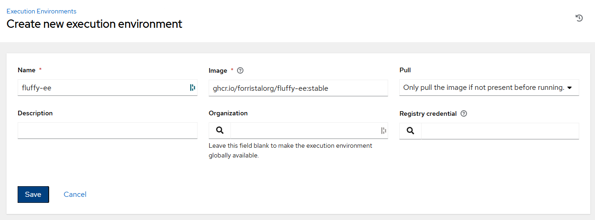

# fluffy-ee - A bigger, better execution environment for Ansible (AWX/AAP)

This [Execution Environment](https://docs.ansible.com/projects/awx/en/24.6.1/userguide/execution_environments.html) is built with more things baked in to save time in the long run.

## Why?

When running ansible against a broad range of hosts including windows and linux, there are a lot of dependencies that the base awx-ee image lacks, or take a long time to set up.  This EE aims to fix that, while also being built with a more up to date and secure base.

## How to use

* In your AWX/AAP environment, go to Adminstration > Execution Environments.
* Click Add, to add a new Execution Environment into your platform.
* Use `ghcr.io/forristalorg/fluffy-ee:stable` for the image.
* Enjoy a fluffier AWX experience.

## Authors

* [tradiuz](https://github.com/tradiuz/)
